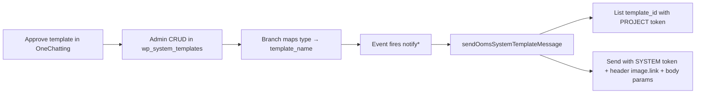

# OOMS System WhatsApp — Server context

> **Purpose:** Tag when adding/changing OOMS System WhatsApp templates, branch mappings, or auto-notify send. Pair with longer architecture notes in [`SERVER/docs/wp_system.md`](../docs/wp_system.md). Related: [`payment-reminder.md`](./payment-reminder.md), [`birthday-reminder.md`](./birthday-reminder.md).

---

## What it is

Branch channel value: **`ooms system`** (`branch_list.whatsapp_channel`).

- Templates live in **`wp_system_templates`** (admin-managed DB; not per-branch OneChatting config).
- Branch only **maps** `type` → `template_name`.
- Map-list types always follow `TEMPLATELIST` in `utils/WhatsAppTemplates.js` (same as OneChatting).
- Backend sends via OneChatting using **env tokens** (user never connects developer token).

Other channels: `disabled` | `ooms web` | `onechatting`.

### OOMS Web (`ooms web`) — WhatsApp Web V2

Upstream: `WHATSAPPWEB_BASE_URL` (default `https://whatsappweb.onesaas.in`). Auth: `WHATSAPPWEB_API_KEY` sent as `x-api-key` on every JSON call.

| Action | Upstream |
|--------|----------|
| Start | `POST /sessions` `{}` → server returns 6-char `data.session` (store in `branch_list.whatsappweb_session`) |
| Status / QR / Delete | `GET/DELETE /sessions/{session}`, `GET .../qr` |
| Reconnect | `POST /sessions/{session}/reconnect` |
| Text | `POST /sessions/{session}/messages` `{ phone, message }` |
| Media | `POST /sessions/{session}/messages/media` `{ phone, file, caption?, fileName? }` |

Login is **QR only** (poll QR during pairing; do not poll status). OOMS proxies under `/broadcast/whatsapp/whatsappweb/*`; helper: `helpers/whatsappWeb.js`.

---

## Workflow (end-to-end)

### 1. Approve in OneChatting / Meta

Create template with:

- Exact `template_name` (e.g. `task_create`, `task_complete`, `payment_reminder`)
- Category (usually `UTILITY`)
- `HEADER` `IMAGE` + `BODY` with `{{1}}…{{n}}`
- Status **APPROVED**

Copy from OneChatting template-list response:

- `template_name`
- Full `components[].example.header_handle[0]` URL (OneChatting proxy URL)
- Exact BODY `text` (must stay Meta-accurate, including typos if approved that way)
- Sample `body_text` for preview

### 2. Store in `wp_system_templates` (Admin)

Manage via **ADMIN** → Settings → System WhatsApp (`/settings/wp-system-templates`), or admin APIs under `/admin/wp-system-templates/*`.

| Field | Role |
|-------|------|
| `type` | Activity key from `TEMPLATELIST` (`task create`, `payment receive`, …) |
| `template_name` | Must match OneChatting / Meta name exactly |
| `template_json` | HEADER IMAGE + BODY; BODY `example.body_text[0]` = **variable keys** in order |
| `example_json` | Frontend preview: same header URL + sample values (not keys) |
| `status` | `active` / `inactive` |

**Header media rule (important):**

- Store the **full absolute** OneChatting `header_handle` URL in both template and example.
- Do **not** use `{BASE_DOMAIN}` or local `/media/wp_system/...` for send/preview.
- On send, that URL is passed as `image.link` in the OneChatting send-template `component`.

Service caches rows briefly (`wpSystemTemplateService`); writes invalidate the cache. Seed: `node scripts/run_wp_system_templates_migration.js` (uses `helpers/wpSystemTemplateSeedData.json`).

### 3. Branch maps type → template

Table: `wp_system_template_mapping`

| Column | Notes |
|--------|--------|
| `branch_id`, `map_id` | `WSTM_<hex>` |
| `type` | Canonical string from `TEMPLATELIST` (case-insensitive match) |
| `template_name` | Chosen variant |
| `status` | `1` active, `0` unset |

APIs (`routes/whatsapp.js`, mount `/api/v1/broadcast/whatsapp`):

| Method | Path | Body / query |
|--------|------|----------------|
| GET | `/wp-system/templates?type=…` | Active variants for one type |
| GET | `/wp-system/template-map-list` | All `TEMPLATELIST` types + mapping status |
| PUT | `/wp-system/template-map/set` | `{ type, template_name }` |
| PUT | `/wp-system/template-map/unset` | `{ type }` |

Frontend: `CLIENT/src/pages/broadcast/whatsapp/OomsSystemTemplates.jsx` (+ picker modal). Types follow **`TEMPLATELIST`** (same as OneChatting Templates).

Prerequisite: `PUT /channel` with `{ "channel": "ooms system" }`.

### 4. Event → variables → send

| Event | Helper | `systemType` / type | Call site |
|-------|--------|---------------------|-----------|
| Task create | `notifyTaskCreatedWhatsapp` | `task create` | `routes/task.js`, task create helpers |
| Task complete | `notifyTaskCompletedWhatsapp` | `task complete` | `routes/task.js`, `routes/compliance.js` |
| Payment reminder | `sendPaymentReminderWhatsapp` | `payment reminder` | `routes/client.js` |
| Payment receive | `notifyPaymentReceiveWhatsapp` | `payment receive` | `routes/transactions.js` |
| Payment (out) | `notifyPaymentWhatsapp` | `payment` | `routes/transactions.js` |
| Birthday wish | `sendBirthdayWishWhatsapp` | `birthday wish` | `routes/client.js` |
| Document sharing | (document share notify) | `document sharing` | document share flows |

Router: `helpers/whatsappNotification.js` → `sendWhatsappByChannel` / `sendOomsSystemTemplateMessage`.

Send service: `services/wpSystemWhatsappSendService.js`

1. `getActiveMapping(branch_id, type)` → `template_name`
2. `findSystemTemplate(type, template_name)` from DB
3. Resolve `template_id` via OneChatting **project** token: `GET …/developer/template/template-list`
4. Build `component`:
   - Header: `{ type: "header", parameters: [{ type: "image", image: { link: "<header_handle URL>" } }] }`
   - Body: ordered text params from variable keys + runtime variables (`{{branch_name}}` filled from `branch_list.name` if missing)
5. POST send with **system** token: `…/developer/message/send-template`

---

## Env (.env)

| Variable | Use |
|----------|-----|
| `ONECHATTING_SYSTEM_DEVELOPER_TOKEN` | **Send** template messages |
| `ONECHATTING_PROJECT_DEVELOPER_TOKEN` | **List** / resolve `template_id` |
| `ONECHATTING_BASE_URL` | Optional; default OneChatting host |

Do **not** swap tokens (list with system token → `Invalid token`).

---

## Currently seeded templates

| `type` | `template_name` |
|--------|-----------------|
| `payment reminder` | `payment_reminder`, `payment_reminder2` |
| `payment receive` | `payment_receive` |
| `payment` | `payment` |
| `birthday wish` | `birthday_wish` |
| `task create` | `task_create` |
| `task complete` | `task_complete` |
| `document sharing` | `document_sharing` |

Stub rows for missing types are placeholders — replace BODY/header with Meta-approved content in Admin before production send.

---

## Adding a new type later (checklist)

1. Add type to `TEMPLATELIST` in `utils/WhatsAppTemplates.js` (and notify helpers if needed).
2. Approve template in OneChatting; note exact `template_name` + copy `header_handle` full URL.
3. Create/edit row in Admin System WhatsApp templates (`type`, keys in BODY example, full header URL).
4. Ensure `whatsappNotification.js` builds variables for those keys and calls send with matching `systemType` string.
5. Wire call site (task / transaction / client route) if not already.
6. Set branch channel to `ooms system`; map type in OOMS System Templates UI.
7. Only `{{…}}` braced keys in WhatsApp component substitution — see [`birthday-reminder.md`](./birthday-reminder.md).

---

## Key files

| File | Role |
|------|------|
| `wp_system_templates` (DB) | Master template definitions + media URLs |
| `helpers/wpSystemTemplateSeedData.json` | Initial seed payload |
| `services/wpSystemTemplateService.js` | DB load/cache, map CRUD, admin CRUD, preview |
| `services/wpSystemWhatsappSendService.js` | Resolve id, build component (incl. image link), send |
| `helpers/whatsappNotification.js` | Channel router + variable builders + notify helpers |
| `routes/whatsapp.js` | `/wp-system/*` + `/channel` APIs |
| `routes_admin/wpSystemTemplates.js` | Admin CRUD APIs |
| `CLIENT/.../OomsSystemTemplates.jsx` | Branch mapping UI |
| `ADMIN/.../WpSystemTemplates.jsx` | Global template content UI |

---

## Do not

- Rewrite header URLs with `{BASE_DOMAIN}` — use OneChatting full URL from template JSON
- Change approved BODY text without a matching Meta template
- Reorder BODY variable keys without matching Meta placeholder order
- Send when channel ≠ `ooms system`, mapping `status ≠ 1`, or tokens missing
