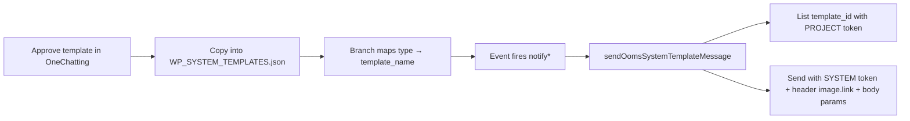

# OOMS System WhatsApp — Server context

> **Purpose:** Tag when adding/changing OOMS System WhatsApp templates, branch mappings, or auto-notify send. Pair with longer architecture notes in [`SERVER/docs/wp_system.md`](../docs/wp_system.md). Related: [`payment-reminder.md`](./payment-reminder.md), [`birthday-reminder.md`](./birthday-reminder.md).

---

## What it is

Branch channel value: **`ooms system`** (`branch_list.whatsapp_channel`).

- Templates live in **our** JSON (not per-branch OneChatting config).
- Branch only **maps** `type` → `template_name`.
- Backend sends via OneChatting using **env tokens** (user never connects developer token).

Other channels: `disabled` | `ooms web` | `onechatting`.

---

## Workflow (end-to-end)



### 1. Approve in OneChatting / Meta

Create template with:

- Exact `template_name` (e.g. `task_create`, `task_complete`, `payment_reminder`)
- Category (usually `UTILITY`)
- `HEADER` `IMAGE` + `BODY` with `{{1}}…{{n}}`
- Status **APPROVED**

Copy from OneChatting template-list response:

- `template_name`
- Full `components[].example.header_handle[0]` URL (OneChatting proxy URL)
- Exact BODY `text` (must stay Meta-accurate, including typos if approved that way)
- Sample `body_text` for preview

### 2. Store in `SERVER/utils/WP_SYSTEM_TEMPLATES.json`

One entry per variant:

| Field | Role |
|-------|------|
| `type` | Activity key used in DB mapping + notify (`task create`, `task complete`, `payment reminder`) |
| `template_name` | Must match OneChatting / Meta name exactly |
| `template.components` | HEADER IMAGE + BODY; BODY `example.body_text[0]` = **variable keys** in order (`{{name}}`, `{{fees}}`, …) |
| `example` | Frontend preview: same header URL + sample values (not keys) |

**Header media rule (important):**

- Store the **full absolute** OneChatting `header_handle` URL in both `template.components` and `example`.
- Do **not** use `{BASE_DOMAIN}` or local `/media/wp_system/...` for send/preview.
- On send, that URL is passed as `image.link` in the OneChatting send-template `component`.

JSON is cached in memory (`wpSystemTemplateService`) — **restart Node** after edits.

### 3. Branch maps type → template

Table: `wp_system_template_mapping`

| Column | Notes |
|--------|--------|
| `branch_id`, `map_id` | `WSTM_<hex>` |
| `type` | Canonical string from JSON (case-insensitive match) |
| `template_name` | Chosen variant |
| `status` | `1` active, `0` unset |

APIs (`routes/whatsapp.js`, mount `/api/v1/broadcast/whatsapp`):

| Method | Path | Body / query |
|--------|------|----------------|
| GET | `/wp-system/templates?type=…` | Variants for one type |
| GET | `/wp-system/template-map-list` | All JSON types + mapping status |
| PUT | `/wp-system/template-map/set` | `{ type, template_name }` |
| PUT | `/wp-system/template-map/unset` | `{ type }` |

Frontend: `CLIENT/src/pages/broadcast/whatsapp/OomsSystemTemplates.jsx` (+ picker modal). Types are **auto-discovered** from JSON — no hardcoding.

Prerequisite: `PUT /channel` with `{ "channel": "ooms system" }`.

### 4. Event → variables → send

| Event | Helper | `systemType` / type | Call site |
|-------|--------|---------------------|-----------|
| Task create | `notifyTaskCreatedWhatsapp` | `task create` | `routes/task.js`, task create helpers |
| Task complete | `notifyTaskCompletedWhatsapp` | `task complete` | `routes/task.js`, `routes/compliance.js` |
| Payment reminder | `sendPaymentReminderWhatsapp` | `payment reminder` | `routes/client.js` |
| Payment receive | `notifyPaymentReceiveWhatsapp` | `payment receive` | `routes/transactions.js` (needs JSON entry when approved) |
| Payment (out) | `notifyPaymentWhatsapp` | `payment` | `routes/transactions.js` (needs JSON entry when approved) |
| Birthday wish | `sendBirthdayWishWhatsapp` | `birthday wish` | `routes/client.js` (needs JSON entry when approved) |

Router: `helpers/whatsappNotification.js` → `sendWhatsappByChannel` / `sendOomsSystemTemplateMessage`.

Send service: `services/wpSystemWhatsappSendService.js`

1. `getActiveMapping(branch_id, type)` → `template_name`
2. `findSystemTemplate(type, template_name)` from JSON
3. Resolve `template_id` via OneChatting **project** token: `GET …/developer/template/template-list`
4. Build `component`:
   - Header: `{ type: "header", parameters: [{ type: "image", image: { link: "<header_handle URL>" } }] }`
   - Body: ordered text params from JSON variable keys + runtime variables (`{{branch_name}}` filled from `branch_list.name` if missing)
5. POST send with **system** token: `…/developer/message/send-template`

```json
{
  "number": "91XXXXXXXXXX",
  "template_id": "<from list>",
  "component": [
    { "type": "header", "parameters": [{ "type": "image", "image": { "link": "https://server.onechatting.com/proxy/templates/..." } }] },
    { "type": "body", "parameters": [{ "type": "text", "text": "..." }] }
  ]
}
```

---

## Env (.env)

| Variable | Use |
|----------|-----|
| `ONECHATTING_SYSTEM_DEVELOPER_TOKEN` | **Send** template messages |
| `ONECHATTING_PROJECT_DEVELOPER_TOKEN` | **List** / resolve `template_id` |
| `ONECHATTING_BASE_URL` | Optional; default OneChatting host |

Do **not** swap tokens (list with system token → `Invalid token`).

---

## Currently shipped templates (JSON)

| `type` | `template_name` | Body vars (order) |
|--------|-----------------|-------------------|
| `payment reminder` | `payment_reminder` | `{{name}}`, `{{balance}}`, `{{branch_name}}`, `{{branch_name}}` |
| `task create` | `task_create` | `{{name}}`, `{{service_name}}`, `{{fees}}`, `{{created_by}}`, `{{due_date}}`, `{{branch_name}}` |
| `task complete` | `task_complete` | `{{name}}`, `{{service_name}}`, `{{completed_by}}`, `{{branch_name}}` |

Header URLs = OneChatting proxy links from the APPROVED template-list payload (stored verbatim in JSON).

---

## Adding a new type later (checklist)

1. Approve template in OneChatting; note exact `template_name` + copy `header_handle` full URL.
2. Append entry to `WP_SYSTEM_TEMPLATES.json` (`type`, keys in BODY example, full header URL in both places).
3. Ensure `whatsappNotification.js` builds variables for those keys and calls send with matching `systemType` string.
4. Wire call site (task / transaction / client route) if not already.
5. Restart server; set branch channel to `ooms system`; map type in OOMS System Templates UI.
6. Only `{{…}}` braced keys in WhatsApp component substitution (bare keys corrupt JSON) — see [`birthday-reminder.md`](./birthday-reminder.md).

---

## Key files

| File | Role |
|------|------|
| `utils/WP_SYSTEM_TEMPLATES.json` | Master template definitions + media URLs |
| `services/wpSystemTemplateService.js` | Load JSON, map CRUD, preview |
| `services/wpSystemWhatsappSendService.js` | Resolve id, build component (incl. image link), send |
| `helpers/whatsappNotification.js` | Channel router + variable builders + notify helpers |
| `routes/whatsapp.js` | `/wp-system/*` + `/channel` APIs |
| `CLIENT/.../OomsSystemTemplates.jsx` | Mapping UI |

---

## Do not

- Rewrite header URLs with `{BASE_DOMAIN}` — use OneChatting full URL from template JSON
- Change approved BODY text in JSON without a matching Meta template
- Reorder BODY variable keys without matching Meta placeholder order
- Expect JSON edits without process restart (in-memory cache)
- Send when channel ≠ `ooms system`, mapping `status ≠ 1`, or tokens missing
