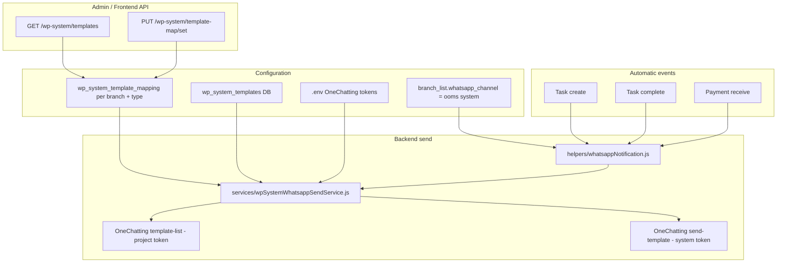

# OOMS System WhatsApp — Context & Integration Guide

Use this document to continue work on the **OOMS System** WhatsApp channel. Share it in future chats so the assistant has full project context without re-explaining the architecture.

---

## Overview

The platform supports **three WhatsApp channels** per branch (`branch_list.whatsapp_channel`):

| Channel value | Description                                                                                                               |
| ------------- | ------------------------------------------------------------------------------------------------------------------------- |
| `disabled`    | No WhatsApp notifications                                                                                                 |
| `ooms system` | Built-in OOMS templates; backend sends via OneChatting with **static env tokens** (user does not connect developer token) |
| `ooms web`    | WhatsApp Web V2 (`WHATSAPPWEB_BASE_URL`, QR-only); branch session + static template content — see [`context/wp_system.md`](../context/wp_system.md) |
| `onechatting` | Official OneChatting integration; user connects their own developer + user tokens                                         |

**OOMS System** is our in-build notification channel:

- Templates are defined centrally in JSON by admins/developers.
- Branches **pick** which template variant to use per activity **type** (e.g. `task create`).
- Sending uses OneChatting APIs under the hood, but users never configure OneChatting credentials.

---

## Architecture


```mermaid
flowchart TB
    subgraph config [Configuration]
        A[branch_list.whatsapp_channel = ooms system]
        B[wp_system_template_mapping per branch + type]
        C[wp_system_templates DB]
        D[.env OneChatting tokens]
    end

    subgraph api [Admin / Frontend API]
        E[GET /wp-system/templates]
        F[PUT /wp-system/template-map/set]
    end

    subgraph events [Automatic events]
        G[Task create]
        H[Task complete]
        I[Payment receive]
    end

    subgraph send [Backend send]
        J[helpers/whatsappNotification.js]
        K[services/wpSystemWhatsappSendService.js]
        L[OneChatting template-list - project token]
        M[OneChatting send-template - system token]
    end

    A --> J
    B --> K
    C --> K
    D --> K
    E --> B
    F --> B
    G --> J
    H --> J
    I --> J
    J --> K
    K --> L
    K --> M
```

---

## Key files

| File                                      | Role                                                                                                      |
| ----------------------------------------- | --------------------------------------------------------------------------------------------------------- |
| `wp_system_templates` (DB)                | Master list of system template definitions (type, template_name, Meta-style components, preview examples) |
| `helpers/wpSystemTemplateSeedData.json`   | Initial seed for migration                                                                                |
| `services/wpSystemTemplateService.js`     | Load DB, list by type, get/set/unset branch mappings, admin CRUD                                          |
| `services/wpSystemWhatsappSendService.js` | Resolve `template_id`, build `component`, send via OneChatting                                            |
| `helpers/whatsappNotification.js`         | Channel router; builds variables; calls send on task/payment events                                       |
| `routes/whatsapp.js`                      | HTTP endpoints for channel + OOMS system template mapping                                                 |
| `routes_admin/wpSystemTemplates.js`       | Admin CRUD for global template content                                                                    |
| `media/wp_system/`                        | Optional local assets (not required when header URLs are absolute OneChatting links)                      |
| `server.js`                               | Serves static files at `/media/wp_system`                                                                 |
| `.env`                                    | `ONECHATTING_SYSTEM_DEVELOPER_TOKEN`, `ONECHATTING_PROJECT_DEVELOPER_TOKEN`                               |

**Route mount:** `routes/index.js` → `/api/v1/broadcast/whatsapp/*`

---

## Database

### `branch_list.whatsapp_channel`

```sql
enum('disabled','ooms system','ooms web','onechatting')
```

### `wp_system_template_mapping`

| Column                                                 | Description                                                  |
| ------------------------------------------------------ | ------------------------------------------------------------ |
| `id`                                                   | Auto increment PK                                            |
| `branch_id`                                            | Branch                                                       |
| `map_id`                                               | e.g. `WSTM_<hex>`                                            |
| `type`                                                 | Activity type string, e.g. `task create`, `payment reminder` |
| `template_name`                                        | Variant from DB, e.g. `task_create`                          |
| `status`                                               | `1` = active, `0` = unset                                    |
| `create_by`, `modify_by`, `create_date`, `modify_date` | Audit                                                        |

Type matching is **case-insensitive** in queries (`LOWER(TRIM(type))`). On set, the canonical `type` from `TEMPLATELIST` is stored.

### `wp_system_templates`

Global template content (admin-managed). Unique on `(type, template_name)`.

---

## Template content (`wp_system_templates`)

Each row stores Meta-style JSON:

```json
{
  "type": "task create",
  "template_name": "task_create",
  "template": {
    "name": "task_create",
    "category": "UTILITY",
    "language": "en",
    "components": ["... HEADER IMAGE, BODY with {{1}} placeholders ..."]
  },
  "example": ["... preview for frontend ..."]
}
```

**Body variables** are defined in `template.components[BODY].example.body_text[0]` as `{{name}}`, `{{branch_name}}`, etc. Order maps to WhatsApp `{{1}}`, `{{2}}`, …

**Header images** use the full absolute URL from each template’s `header_handle` (typically the OneChatting proxy URL from the approved template). That same URL is sent as the header `image.link` for every notification type — no `{BASE_DOMAIN}` rewriting.

Map-list types always come from `TEMPLATELIST` (same as OneChatting Templates). Manage content in ADMIN → Settings → System WhatsApp.

To add a new type: add to `TEMPLATELIST`, create a DB row (Admin UI), ensure matching template is **APPROVED** in OneChatting under the same `template_name`, then branches map it via API.

---

## Environment variables

```env
ONECHATTING_SYSTEM_DEVELOPER_TOKEN=<user developer token>   # SEND messages
ONECHATTING_PROJECT_DEVELOPER_TOKEN=<project developer token> # LIST templates
ONECHATTING_BASE_URL=https://server.onechatting.com         # optional override
```

### Critical token split (verified working)

| Operation             | Token                       | OneChatting endpoint                    |
| --------------------- | --------------------------- | --------------------------------------- |
| Resolve `template_id` | **Project** developer token | `GET /developer/template/template-list` |
| Send template message | **System** developer token  | `POST /developer/message/send-template` |

Do **not** use the system token for template-list — it returns `Invalid token`.

After `.env` changes: `pm2 restart 0 --update-env`

---

## API endpoints

**Base:** `/api/v1/broadcast/whatsapp`

**Headers:** `token`, `username`, `branch` (or `branch_id` query fallback)

### Channel (prerequisite)

| Method | Path       | Body                           | Notes                                  |
| ------ | ---------- | ------------------------------ | -------------------------------------- |
| `GET`  | `/channel` | —                              | Returns `{ channel }`                  |
| `PUT`  | `/channel` | `{ "channel": "ooms system" }` | Must be `ooms system` for this feature |

### OOMS system templates

| Method | Path                                    | Body / query                                                |
| ------ | --------------------------------------- | ----------------------------------------------------------- |
| `GET`  | `/wp-system/templates?type=task create` | Lists variants + `active_template_name`                     |
| `GET`  | `/wp-system/template-map-list`          | All JSON types with branch mapping status                   |
| `PUT`  | `/wp-system/template-map/set`           | `{ "type": "task create", "template_name": "task_create" }` |
| `PUT`  | `/wp-system/template-map/unset`         | `{ "type": "task create" }`                                 |

User does **not** submit `component` JSON (unlike OneChatting channel). Backend builds it from DB template + variables.

---

## Send flow (`sendOomsSystemTemplateMessage`)

1. Validate `branch_id`, `systemType`, `recipientNumber`
2. Load **system** + **project** tokens from env
3. `getActiveMapping(branch_id, systemType)` → `template_name`
4. `findSystemTemplate(type, template_name)` from DB
5. `resolveTemplateId(projectToken, template_name)` — paginated APPROVED list
6. Build `component` array (header image + body text parameters)
7. Substitute variables (`{{name}}`, `{{branch_name}}`, …); `{{branch_name}}` from `branch_list.name` if not provided
8. POST send with **system** token:

```json
POST /developer/message/send-template
Headers: { "token": "<ONECHATTING_SYSTEM_DEVELOPER_TOKEN>" }
Body: {
  "number": "91XXXXXXXXXX",
  "template_id": "<from template-list>",
  "component": [
    { "type": "header", "parameters": [{ "type": "image", "image": { "link": "https://..." } }] },
    { "type": "body", "parameters": [{ "type": "text", "text": "..." }, ...] }
  ]
}
```

Returns `{ ok, reason?, template_id?, response? }` — failures are silent to end users (no throw unless outer catch in notify helpers).

---

## Automatic event hooks

Implemented in `helpers/whatsappNotification.js`. Fired asynchronously via `notify*` helpers (fire-and-forget).

| Event             | Helper                         | systemType / type string | Called from                                                             |
| ----------------- | ------------------------------ | ------------------------ | ----------------------------------------------------------------------- |
| Task create       | `notifyTaskCreatedWhatsapp`    | `task create`            | `routes/task.js` (multi + legacy create), `helpers/taskCreateHelper.js` |
| Task complete     | `notifyTaskCompletedWhatsapp`  | `task complete`          | `routes/task.js`, `routes/compliance.js`                                |
| Payment receive   | `notifyPaymentReceiveWhatsapp` | `payment receive`        | `routes/transactions.js`                                                |
| Payment           | `notifyPaymentWhatsapp`        | `payment`                | `routes/transactions.js`                                                |
| Payment reminder  | `sendPaymentReminderWhatsapp`  | `payment reminder`       | `routes/client.js`                                                      |
| Birthday wish     | `sendBirthdayWishWhatsapp`     | `birthday wish`          | `routes/client.js`                                                      |

**Task create** uses an explicit `ooms system` branch in `sendTaskCreatedWhatsapp` before falling back to other channels. Other events use `sendWhatsappByChannel`, which routes to OOMS system when the branch channel is `ooms system`.

**Requirements for send:**

- `whatsapp_channel === "ooms system"`
- Active mapping for that `type` in `wp_system_template_mapping`
- Client mobile on profile
- Both env tokens set
- Template approved in OneChatting with matching `template_name`

### Task create variables (built in `buildTaskCreateVariables`)

`{{name}}`, `{{mobile}}`, `{{email}}`, `{{firm_name}}`, `{{service_name}}`, `{{due_date}}`, `{{created_by}}`, `{{created_date}}`, `{{fees}}`, `{{payment_link}}`, `{{balance}}`, plus `{{branch_name}}` at send time.

### Task complete variables (`buildTaskCompleteVariables`)

`{{name}}`, `{{service_name}}`, `{{fees}}`, `{{completed_by}}`, `{{completed_date}}`, `{{branch_name}}`, etc.

### Payment receive variables (`buildPaymentReceiveVariables`)

`{{name}}`, `{{received_amount}}`, `{{amount}}`, `{{received_by}}`, `{{transaction_date}}`, `{{invoice_no}}`, `{{opening_balance}}`, `{{closing_balance}}`, plus `{{branch_name}}` at send time.

### Payment variables (`buildPaymentVariables`)

`{{name}}`, `{{amount}}`, `{{firm_name}}`, `{{paid_by}}`, `{{transaction_date}}`, `{{invoice_no}}`, plus `{{branch_name}}` at send time.

### Birthday wish variables

`{{name}}`, `{{username}}`, `{{mobile}}`, `{{email}}`, `{{current_date}}`, plus `{{branch_name}}` at send time.

---

## Differences vs other channels

|                           | OOMS System                | OneChatting                          | WhatsApp Web            |
| ------------------------- | -------------------------- | ------------------------------------ | ----------------------- |
| User token setup          | No                         | Yes                                  | Session/QR              |
| User provides `component` | No                         | Yes                                  | Custom content in DB    |
| Template source           | `wp_system_templates` DB   | User's OneChatting account           | Branch static templates |
| Mapping API body          | `{ type, template_name }`  | `{ name, template_name, component }` | Different service       |

---

## Frontend integration (summary)

1. `GET /channel` → show channel selector
2. If `ooms system`: show `GET /wp-system/template-map-list`
3. Per type: `GET /wp-system/templates?type=...` → preview cards → `PUT /wp-system/template-map/set`
4. No send button needed for task create/complete — automatic after mapping

Preview from API response:

- Image: `templates[n].example[0].example.header_handle[0]`
- Body sample: `templates[n].example[1].example.body_text[0]`
- Variables: `templates[n].available_variables`

---

## Implementation status (as of 2026-06-27)

### Done

- OOMS system channel enum + PUT/GET `/channel`
- Template list / map list / set / unset APIs
- `wp_system_template_mapping` CRUD service
- Send service with dual-token split (project list + system send)
- Task create auto-send on `ooms system` channel
- Task complete / payment receive / payment / payment reminder / birthday wish JSON + channel router
- Generic `sendWhatsappByChannel` OOMS system path for other events
- Static media served at `/media/wp_system`
- Debug logging removed after verification

### Pending / future work

- Add more template variants (designs) per type in Admin
- Replace stub BODY/header content for new types with Meta-approved copy
- Optional: richer Admin UI for components (without raw JSON)

---

## Adding a new template type (checklist)

1. Add the type to `TEMPLATELIST` in `utils/WhatsAppTemplates.js` if new
2. Create Meta-approved template in OneChatting portal; note exact `template_name`
3. Add row via Admin System WhatsApp UI (match `template_name`, define `type`, components, variables)
4. Add absolute `header_handle` URL from the OneChatting approved template (no `{BASE_DOMAIN}`)
5. Ensure `whatsappNotification.js` (or caller) supplies all BODY keys
6. Call `sendOomsSystemTemplateMessage({ branch_id, systemType: "<type>", recipientNumber, variables })` from the relevant event hook, or rely on `sendWhatsappByChannel` if `systemTemplateName` matches the type string

---

## Troubleshooting

| Symptom                          | Likely cause                                                                    |
| -------------------------------- | ------------------------------------------------------------------------------- |
| No message on task create        | Channel not `ooms system`, no mapping, no client mobile, or template not mapped |
| `Invalid token` on template list | Using system token instead of project token for list                            |
| `template_id_not_found`          | `template_name` in DB ≠ OneChatting approved template name                      |
| Message fails on send            | System token invalid, or `component` / image URL not accessible publicly        |
| Wrong channel path               | Branch still on `onechatting` — check `GET /channel`                            |

---

## Related constants (`helpers/whatsappNotification.js`)

```js
TASK_CREATE_TEMPLATE_NAME = "task create";
TASK_COMPLETE_TEMPLATE_NAME = "task complete";
PAYMENT_RECEIVE_TEMPLATE_NAME = "payment receive";
PAYMENT_TEMPLATE_NAME = "payment";
PAYMENT_REMINDER_TEMPLATE_NAME = "payment reminder";
BIRTHDAY_WISH_TEMPLATE_NAME = "birthday wish";
WHATSAPP_CHANNEL_OOMS_SYSTEM = "ooms system";
```

Channel value from DB is normalized: `trim().toLowerCase()` before compare.
